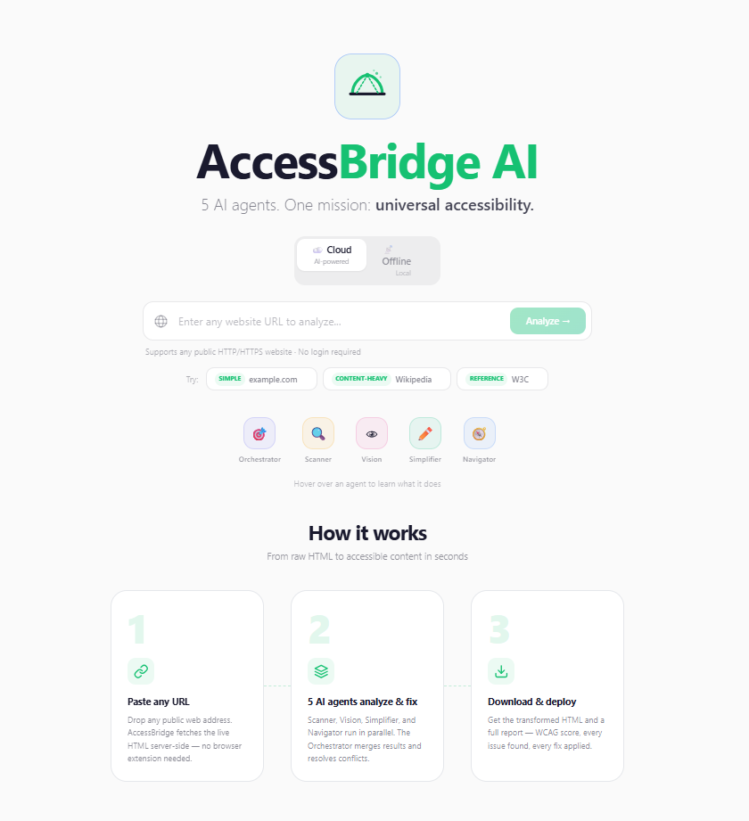
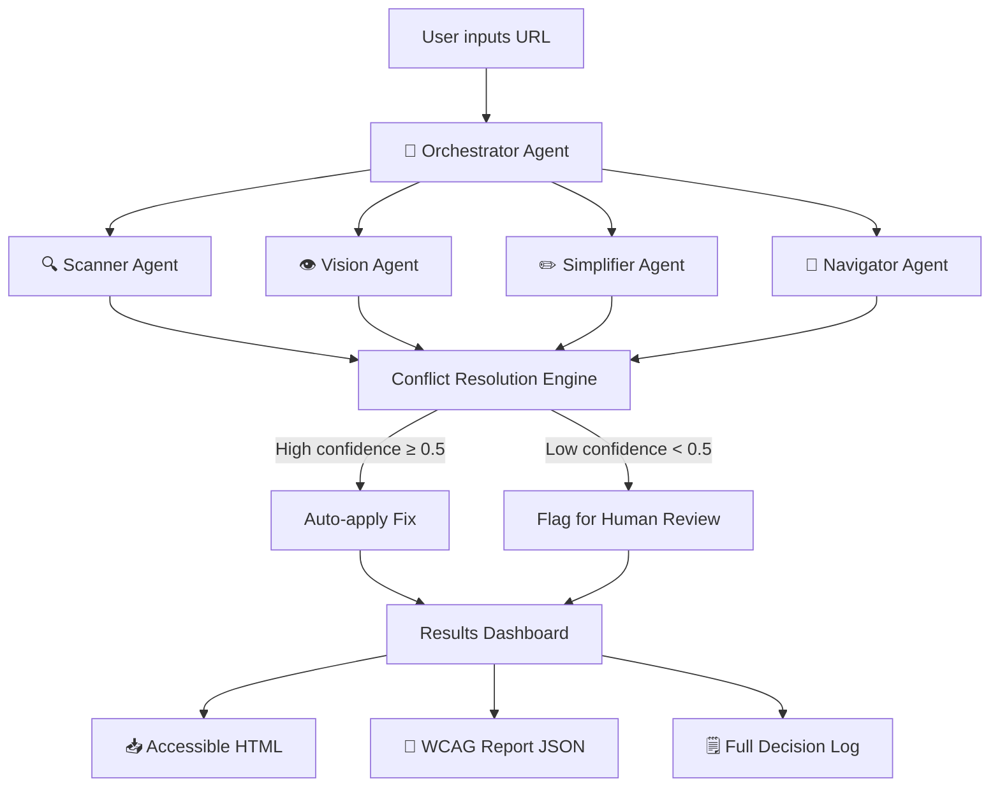

# 🌉 AccessBridge AI

> **5 AI agents. One mission: universal accessibility.**

AccessBridge AI is a multi-agent system that transforms any web page into universally accessible content in real-time. Unlike traditional accessibility tools that only *detect* problems, AccessBridge **automatically fixes them** using specialized AI agents that collaborate, negotiate, and explain every decision they make.

Built for the [JS AI Build-a-thon 2026](https://aka.ms/JSAIBuildathon) — **Agents for Impact**.

**[🚀 Live Demo](https://accessbridge-ld96l1r00-jpablortiz96s-projects.vercel.app/)** · **[GitHub](https://github.com/jpablortiz96/accessbridge-ai)** · **[📋 Blog Post](https://dev.to/jpablortiz96/building-accessbridge-ai-how-5-ai-agents-collaborate-to-make-the-web-accessible-24kf)** · **[📹 Video Demo](https://youtu.be/SFbjWWApP4M)**

---

## 📸 Screenshots

## Landing page


<!-- Analysis results -->
<!--  -->

---

## 🎯 What Makes It Different

| Traditional Tools | AccessBridge AI |
|---|---|
| Detect problems | Detect **and** fix automatically |
| Single analysis engine | 5 specialized AI agents |
| Static reports | Real-time agent orchestration |
| Cloud-only | Cloud **and** Offline modes |
| Black box | Transparent decisions + confidence scores |

---

## 🤖 The 5 Agents

| Agent | Role | Technology |
|---|---|---|
| 🎯 **Orchestrator** | Coordinates all agents, resolves conflicts, applies fixes | Custom engine |
| 🔍 **Scanner** | WCAG 2.1 audit — 20+ rules across all 4 principles | Static analysis + cheerio |
| 👁 **Vision** | Contextual alt-text generation for images | Azure OpenAI GPT-4o |
| ✏️ **Simplifier** | Plain language rewriting (Flesch-Kincaid scoring) | Azure OpenAI GPT-4o |
| 🧭 **Navigator** | Semantic structure: headings, landmarks, skip links, ARIA | Rule-based |

Every agent runs in parallel. The Orchestrator then resolves conflicts (e.g., Vision vs Simplifier targeting the same element), applies high-confidence fixes automatically, and flags low-confidence suggestions for human review.

---

## 🏗️ Architecture



### Key Architectural Decisions

- **Parallel execution** — all 4 specialist agents run concurrently via `Promise.all`
- **Conflict resolution** — Vision always wins over Simplifier on the same element; duplicate WCAG rules from different agents are deduplicated
- **Additive scoring** — `scoreBefore` reflects only pre-existing issues (Scanner + Navigator); `scoreAfter` adds `FIX_POINTS` per applied fix, making improvement honest and non-decreasing
- **`isEnhancement` flag** — Vision and Simplifier issues are improvements, not pre-existing defects; excluded from the baseline score
- **Server-side fetch** — the orchestrator fetches the target URL server-side with a 15s timeout, never exposing API keys to the browser

---

## 🚀 Quick Start

### Prerequisites

- Node.js 18+
- An Azure OpenAI resource with a `gpt-4o` deployment *(for Cloud mode only — Offline mode needs no API key)*

### Installation

```bash
git clone https://github.com/jpablortiz96/accessbridge-ai.git
cd accessbridge-ai
npm install
```

### Environment Setup

```bash
cp .env.example .env.local
# Edit .env.local with your Azure OpenAI credentials
```

### Development

```bash
npm run dev
# Open http://localhost:3000
```

> **Corporate network?** The dev script includes `NODE_TLS_REJECT_UNAUTHORIZED=0` to handle self-signed proxy certificates in development. This flag is **not** applied to `npm run build` or `npm start`.

### Production Build

```bash
npm run build
npm start
```

---

## ☁️ Cloud vs 📡 Offline

| Feature | ☁️ Cloud | 📡 Offline |
|---|---|---|
| 🔍 Scanner Agent | ✅ Full (20+ WCAG rules) | ✅ Full |
| 👁 Vision Agent | ✅ AI-powered contextual alt-text | ⚡ 5-tier heuristic alt-text |
| ✏️ Simplifier Agent | ✅ AI plain-language rewriting | ⚡ Deterministic sentence splitting |
| 🧭 Navigator Agent | ✅ Full | ✅ Full |
| Accuracy | High (85%+) | Moderate (60%+) |
| Typical speed | ~10–15 seconds | ~1–3 seconds |
| API key required | Yes | No |
| Data privacy | Processed via Azure OpenAI | Zero external transmission |

The Offline mode is genuinely useful — the heuristic Vision agent uses 5 priority tiers (link context → figcaption → filename → nearest heading → domain) and the Simplifier deterministically splits sentences over 30 words at natural break points (commas → conjunctions → midpoint). Tested on Wikipedia: Cloud +37 pts, Offline +31 pts.

---

## 📁 Project Structure

```
src/
├── agents/
│   ├── orchestrator.ts        # Central coordinator
│   ├── scanner.ts             # WCAG static analysis
│   ├── vision.ts              # Azure OpenAI alt-text
│   ├── simplifier.ts          # Azure OpenAI plain language
│   ├── navigator.ts           # Semantic structure
│   └── offline/
│       ├── offline-scanner.ts    # Re-exports scanner (full)
│       ├── offline-navigator.ts  # Re-exports navigator (full)
│       ├── offline-vision.ts     # 5-tier heuristic alt-text
│       └── offline-simplifier.ts # Deterministic sentence split
├── app/
│   ├── page.tsx               # Landing page
│   ├── analyze/
│   │   └── page.tsx           # Results dashboard
│   └── api/
│       └── analyze/
│           └── route.ts       # POST /api/analyze
├── components/
│   ├── AgentTimeline.tsx      # Live agent progress UI
│   ├── BridgeIcon.tsx         # SVG logo
│   ├── ModeToggle.tsx         # Cloud / Offline segmented control
│   ├── UrlInput.tsx           # URL input form
│   └── responsible-ai-panel.tsx # RAI transparency UI
├── lib/
│   └── azure-client.ts        # Azure OpenAI client singleton
└── types/
    └── agents.ts              # All shared TypeScript types
```

---

## 🛡️ Responsible AI

AccessBridge AI is designed with responsible AI principles at every layer:

| Principle | Implementation |
|---|---|
| **Transparency** | Every agent decision is logged with timestamp, agent identity, and reasoning. Full decision log available per analysis. |
| **Human-in-the-Loop** | Fixes with confidence < 0.5 are never auto-applied — flagged as suggestions for human review. |
| **Confidence Scoring** | Each fix carries a 0–1 confidence score. The orchestrator only auto-applies fixes at ≥ 0.5. |
| **Privacy & Safety** | No user data stored. All processing is ephemeral (session-only). Content safety filters applied to all AI prompts. |
| **Explainability** | Conflict resolutions are narrated. The UI shows which agent proposed each fix and why it was accepted or overridden. |

---

## 🛠️ Tech Stack

| Layer | Technology |
|---|---|
| Framework | Next.js 14 (App Router), React 18, TypeScript |
| Styling | Tailwind CSS, Plus Jakarta Sans, IBM Plex fonts |
| AI | Azure OpenAI (GPT-4o) |
| HTML Parsing | cheerio |
| Offline AI | Rule-based heuristics (Foundry Local architecture-ready) |
| Deployment | Vercel / Azure App Service |
| PWA | Web manifest, SVG favicon, theme color |

---

## 📊 Results

Benchmarked across popular public websites:

| Metric | Result |
|---|---|
| Average score improvement | **+31 to +37 points** |
| Typical issues detected per page | **15–25** |
| Auto-fix rate | **60–70%** |
| Cloud analysis time | **10–15 seconds** |
| Offline analysis time | **1–3 seconds** |
| WCAG rules covered | **20+** across all 4 principles |

---

## 🏆 Hackathon

**JS AI Build-a-thon 2026 — Agents for Impact**

| Category | Approach |
|---|---|
| Agents for Impact | Real accessibility impact via multi-agent orchestration |
| Agentic Architecture | Visible orchestration, conflict resolution, transparency panel |
| Grand Prize criteria | Deep AI integration across all judging dimensions |
| Offline-Ready AI | Full offline capability; Foundry Local architecture pattern |
| AI-Powered Builder | Built entirely with Claude Code AI assistance |

---

## 👤 Author

**Juan Pablo Enriquez Ortiz**
[GitHub](https://github.com/jpablortiz96)

---

## 📝 License

MIT — see [LICENSE](LICENSE) for details.

---

*Built with ❤️ for the JS AI Build-a-thon — because the web should work for everyone.*
